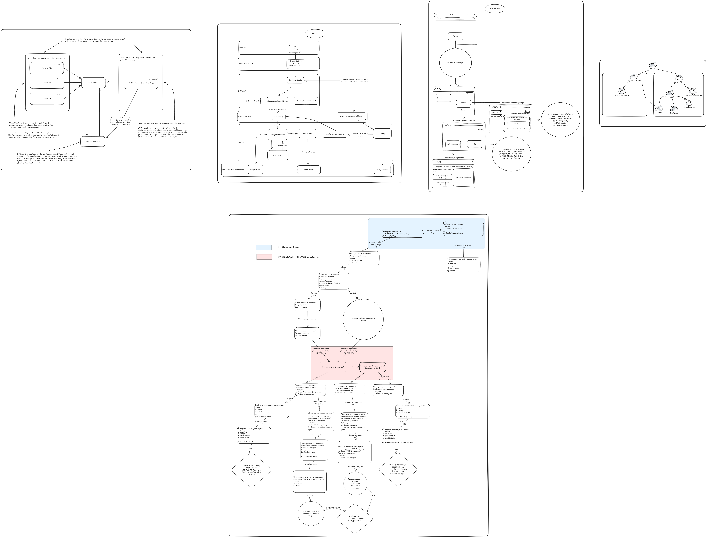

## 1. Общая концепция

ASMSR — это облачная платформа класса B2B SaaS, предназначенная для владельцев звукозаписывающих студий. Она позволяет им централизованно управлять своей студией: бронированием времени, учетом клиентов, хранением файлов, оплатой услуг и аналитикой. Клиенты студии взаимодействуют с системой через персонализированный лендинг-сайт, созданный владельцем.

## 2. Архитектурные компоненты

### 2.1. SaaS Backend

**Назначение**: Центральный сервис, обрабатывающий все пользовательские запросы, управление сессиями, авторизацией, подписками и основными бизнес-логиками.

**Функции**:

- Приём и обработка входящих запросов от всех точек входа.
- Управление пользователями: регистрация, авторизация, привязка к `studio_id`.
- Создание новой студии при успешной оплате подписки.
- Передача данных в ASMSR Backend для мониторинга и аналитики.
- Интеграция с внешними платежными шлюзами (подразумевается).

**Требования**:

- Поддержка многопользовательской среды с изоляцией данных по `studio_id`.

---

### 2.2. ASMSR Backend

**Назначение**: Внутренняя система разработчика, обеспечивающая полный контроль над платформой, сбором данных и администрированием.

**Функции**:

- Мониторинг всех активностей в системе: кто, когда, что делал.
- Сбор и хранение всех данных: пользователи, студии, файлы, транзакции, истории действий.
- Аналитика: количество активных студий, пользователей, объем хранимых данных, статистика оплат.
- Административный интерфейс для управления пользователями, студиями, подписками (должен быть реализован).
- Интеграция с SaaS Backend для получения данных в реальном времени.

## 3. Пользовательские роли и точки входа

Система поддерживает три основные роли:

### 3.1. Владелец студии (Studio Owner)

- **Роль**: B2B-клиент, покупатель подписки.
- **Точка входа**: `ASMSR Product Landing Page`, `Owner’s Site`.
- **Процесс регистрации**:
  - Регистрация доступна только как потенциальный покупатель сервиса. При этом он может зарегистрироваться как клиент в другой студии `Another Owner’s Site`/войти в личный кабинет владельца своей студии через `ASMSR Product Landing Page`, `Owner’s Site`. Регистрируется только через `ASMSR Product Landing Page`.
  - После оплаты подписки система автоматически создает новую студию с уникальным `studio_id` и привязывает к ней аккаунт владельца.
  - Владелец получает доступ к своей студии и персональному `Owner’s Site` (если он заказал у нас сайт) — брендированному лендингу для его клиентов.

### 3.2. Клиент студии (Studio Client)

- **Роль**: Конечный пользователь, заказчик услуг звукозаписи.
- **Точка входа**: `Owner’s Site` конкретной студии, `ASMSR Product Landing Page`.
- **Процесс регистрации/авторизации**:
  - Клиент заходит на сайт студии (например, `studio123.asmsr.com`), где видит кнопки Login / Registration.
  - При регистрации система связывает его аккаунт с `studio_id` этой студии.
  - Все действия клиента (бронирование, загрузка файлов, оплата) привязаны к его студии.
  - Регистрируется только через `Owner’s Site` конкретной студии, но может войти в личный кабинет как на `Owner’s Site` конкретной студии, так и на `ASMSR Product Landing Page`, выбрав студию, в которых он числится.
- **Особенности**:
  - Не имеет доступа к `ASMSR Product Landing Page` для регистрации.
  - Может быть сотрудником студии — в этом случае он использует тот же `Owner’s Site` или `ASMSR Product Landing Page`, но с расширенными правами (роли управляются через SaaS Backend). Обе страницы предлагают ему, под каким профилем/ролью зайти в систему, если он является сотрудником и клиентом одновременно.

### 3.3. Потенциальный покупатель (Potential Buyer) TODO: В будущем — LEAD.

- **Роль**: Человек, рассматривающий возможность покупки подписки, но ещё не владелец студии.
- **Точка входа**: `ASMSR Product Landing Page`.
- **Процесс**:
  - Может просматривать продукт, ознакомиться с функциями.
  - Регистрация возможна только как потенциальный владелец студии.
  - После оплаты становится владельцем своей студии внутри нашего продукта и `Owner’s Site`, если заказал его у нас.

## 4. Идентификация и изоляция данных

- **Каждая студия имеет уникальный идентификатор `studio_id`**, который используется для:
  - Привязки пользователей (владельцев, клиентов, сотрудников).
  - Изоляции данных (файлы, записи, транзакции, расписания).
  - Формирования персонализированных лендингов (`Owner’s Site`).
- **Данные не пересекаются между студиями** — даже если два клиента имеют одинаковые email, они считаются разными пользователями, если принадлежат разным студиям. (TODO: ?)
- **SaaS Backend** гарантирует изоляцию данных на уровне бизнес-логики и базы данных.

## 5. Управление пользователями и аккаунтами

- **Ответственность за аккаунты**: Платформа (ASMSR) берёт на себя полную ответственность за учётные записи всех пользователей — владельцев, клиентов, сотрудников.
- **Роли и права**:
  - Владелец студии — полный доступ к управлению своей студией.
  - Клиент — ограниченный доступ (редактирование профиля, просмотр расписания, бронирование, загрузка файлов, общение по проекту с сотрудниками студии, работа с проектами, заказ услуг конкретной студии).
  - Сотрудник — расширенные права (редактирование записей, профиля, управление подпроектами проекта клиента, загрузка файлов и т.д.) — назначается владельцем.
- **Учётные данные хранятся в единой базе SaaS Backend**, но сегментируются по `studio_id`.

## 6. Требования к контролю и мониторингу

ASMSR Backend должен обеспечивать:

- **Полный аудит**: Логирование всех действий пользователей (регистрация, вход, загрузка файла, бронирование, оплата).
- **Аналитические дашборды**: Для отслеживания метрик: количество активных студий, пользователей, доходов, объема хранимых данных.
- **Централизованный доступ к данным**: Возможность экспорта, поиска, фильтрации по любому параметру (студия, пользователь, дата, тип действия).
- **Интеграция с SaaS Backend**: Через API или сообщения для передачи событий в режиме реального времени.

---

### prod 17.11.25/

1. **Presentation Layer (main.py):**

   - `main.py`: Точка входа в приложение. Содержит логику инициализации и тестового запуска. Вызывает `run_test()` для симуляции подтверждения бронирования.
   - `run_test()`: Создает объект `Booking`, вызывает его метод `confirm()`, тем самым инициируя цепочку событий.

2. **Domain Layer (Бизнес-логика):**

   - `Booking`: Доменная сущность. При вызове метода `confirm()` создает и публикует событие `BookingConfirmedEvent`.
   - `BookingConfirmedEvent`, `BookingCancelledEvent`: Доменные события, наследующиеся от `DomainEvent`. Содержат данные о произошедшем событии.

   Реализует бизнес-правила подтверждения бронирования и генерацию соответствующего события.

3. **Application Layer (Сервисы приложения):**

   - `DistributedEventPublisher`: Публикует доменное событие в очередь Celery (`handle_domain_event`), обеспечивая взаимодействие между процессами.
   - `EventBus`: Локальная шина событий (внутри процесса). Принимает события от `handle_domain_event` и направляет их подписанным обработчикам (`TelegramNotifier`).

   `DistributedEventPublisher` реализует **Event-Driven Architecture** и **Celery** для асинхронной доставки событий. `EventBus` позволяет внутренним компонентам реагировать на события.

4. **Infrastructure Layer (Инфраструктура):**

   - `celery_app.py`: Настройка и инициализация Celery для асинхронного выполнения задач.
   - `event_tasks.py`: Содержит задачу `handle_domain_event`, которая запускается через Celery. Дессериализует событие и публикует его в локальный `EventBus`.
   - `notifications/telegram_notifier.py`: Инфраструктурный сервис, реализующий **паттерн Observer**. Подписывается на `BookingConfirmedEvent` через `EventBus`. При получении события, получает `chat_id` из `RedisClient`, формирует сообщение и отправляет его в Telegram API с использованием retry-логики.
   - `notifications/retry_mechanism.py`: Декоратор `with_retry` реализует **retry-механизмы с экспоненциальной задержкой** для 100% отправки сообщений в Telegram API.
   - `redis_client.py`: Инфраструктурный клиент для работы с **Redis**. Используется `TelegramNotifier` для **кеширования сессий пользователей** (в данном случае, `chat_id`).

   Реализует интеграцию с внешними сервисами (Telegram, Redis), асинхронную обработку через Celery, обработку ошибок и кэширование.

5. **Внешние зависимости:**

   - **Telegram API:** Внешний сервис для отправки уведомлений.
   - **Redis Server:** Используется для кэширования `chat_id`.
   - **Celery Workers:** Отдельные процессы, выполняющие асинхронные задачи, такие как `handle_domain_event`.

- **Event-Driven Architecture:** Показана через `Booking` -> `Event` -> `DistributedEventPublisher` -> `Celery` -> `EventBus` -> `Observer`.
- **Observer Pattern:** `TelegramNotifier` является Observer'ом для `BookingConfirmedEvent`, подписываясь через `EventBus.subscribe`.
- **Retry-механизмы:** Показаны через декоратор `with_retry`, оборачивающий метод `_send_telegram_message` в `TelegramNotifier`.
- **Кэширование в Redis:** Показано через `TelegramNotifier` -> `RedisClient` -> `Redis Server`.
- **Celery:** Показан как инфраструктурный компонент для асинхронной обработки событий и выполнения фоновых задач, интегрированный с `DistributedEventPublisher` и `event_tasks`.
